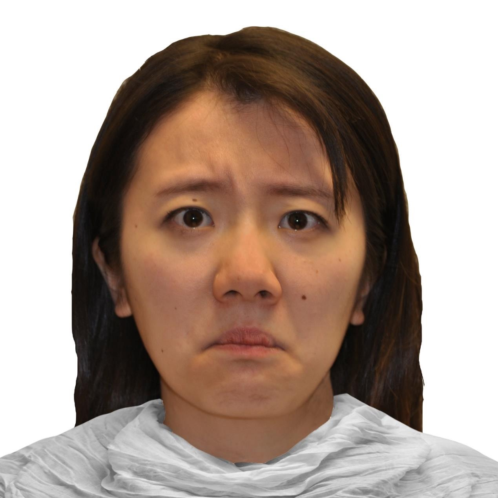

# Supplementary Materials for SW1 Challenge

This repo contains supplementary materials for the 1st SpeechWellness Challenge

## The North Wind and The Sun passage
This section shows _The North Wind and The Sun_ passage, used in the passage reading task. The subjects read in mandarin. English translation is provided for reference.

北风和太阳争辩，谁最有力量，他们决定，谁能先让路上的行人把衣服脱下，便算是胜利者。北风先施展威力，猛烈地刮了起来；但是风吹得越大，行人就将他的衣服裹得越紧。最后北风无可奈何，请太阳出来，要看看他的本领。刹那间拨云见日，阳光普照，行人们感觉到温热，便将衣服一 件一件地脱下，更加轻松地享受他们的行程。

The North Wind and the Sun were disputing which was the stronger, when a traveller came along wrapped in a warm cloak. They agreed that the one who first succeeded in making the traveller take his cloak off should be considered stronger than the other. Then the North Wind blew as hard as he could, but the more he blew the more closely did the traveller fold his cloak around him; and at last the North Wind gave up the attempt. Then the Sun shined out warmly, and immediately the traveller took off his cloak. 

## The Facial Expression Image
The facial expression used in expression description task is shown in the following figure. The image is taken from _M. I. Conley, D. V. Dellarco, E. Rubien-Thomas, A. O. Cohen, A. Cervera, N. Tottenham, and B. Casey, "The racially diverse affective expression (radiate) face stimulus set," Psychiatry research, vol. 270, pp. 1059–1067, 2018. 53_.

  
  
<b>Figure 1:</b> The facial expression used in ED Task. 

## Prompts used for data filtering

This section provides prompts used for task relevance check and sensitive information exposure check (both Chinese version and English translation are provided).

### Prompt for task relevance check

我做了一些访谈，我现在想要判断访谈对象**是否完成了指定的任务（即，回答是否与任务相关）**，我会给你问题介绍，以及录音的自动转录本，它是一整段录音的转录（同时包含了受试者的语音和采访者的语音）。
采访者可能会对受试者做一些引导，只需要关注受试者的语音部分。因为是自动转录，可能会出现错字或者错词，不用把这种情况纳入考虑。
如果受试者回答与任务相关，则回答“是”，反之则回答“否”，只回答“是”或“否”，不要出现其他回答。

I conducted some interviews, and now I want to determine whether the interviewees have **completed the specified task (i.e., whether their responses are related to the task)**. I will provide you with an introduction to the question and an automated transcription of the recording, which is a transcript of the entire recording (including both the interviewee’s and the interviewer’s speech).
The interviewer may guide the interviewee, but you only need to focus on the interviewee’s speech. Since this is an automated transcription, there may be errors in words or characters, but these do not need to be considered.
If the interviewee’s response **is related to the task**, answer “Yes”; otherwise, answer “No”. Only respond with “Yes” or “No”, and do not provide any other answers.

### Prompt for information exposure check

我做了一些访谈，我现在想要判断访谈对象的回答中**是否涉及到了与隐私相关的敏感信息（如，人名、地名，或是其他任何直接或间接涉及隐私的信息）**，我会给你问题介绍，以及录音的自动转录本，它是一整段录音的转录（同时包含了受试者的语音和采访者的语音）。
采访者可能会对受试者做一些引导，只需要关注受试者的语音部分。因为是自动转录，可能会出现错字或者错词，不用把这种情况纳入考虑。
如果受试者回答不包括敏感信息，则回答“是”，反之则回答“否”，只回答“是”或“否”，不要出现其他回答。

I conducted some interviews, and now I want to determine whether the interviewees’ responses **contain sensitive information related to privacy (such as names, place names, or any other information that directly or indirectly involves privacy).** I will provide you with an introduction to the question and an automated transcription of the recording, which is a transcript of the entire recording (including both the interviewee’s and the interviewer’s speech).
The interviewer may guide the interviewee, but you only need to focus on the interviewee’s speech. Since this is an automated transcription, there may be errors in words or characters, but these do not need to be considered.
If the interviewee’s response **does not include sensitive information**, answer “Yes”; otherwise, answer “No”. Only respond with “Yes” or “No”, and do not provide any other answers.

## The MINI-KID interview
In this study, the adolescent suicide risk is assessed using the suicidality module of the MINI-KID interview, which includes questions formatted in a binary yes/no format. Participants were classified as either at risk or not at risk for suicide based on the standard scoring and administration procedures for this module. The detailed questions and instructions can be found [here](MINI-KID-suicide-module.pdf).
